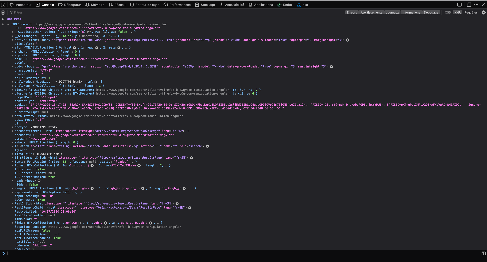

# Manipulation DOM 
Le DOM (Document Object Model) est une API utilisée pour décrire la structure logique des documents HTML et comment ces derniers sont accédés et manipulés.

Le JavaScript utilise cette API pour faciliter la manipulation des différents éléments d'une page Web. Le Document Object est un objet qui représente la page HTML actuellement chargé dans le navigateur et représente l’objet de base pour tous les opérations de manipulation du DOM en JavaScript. 
Voici une représentation de l’objet document 

Bien que l’on retrouve beaucoup de proriétés et de méthodes dans l’objet document, nous allons voir simplement les méthodes les plus courantes utilisées pour cibler et récupérer un noeud de l’arborescence HTML.

|Méthode|Fonctionnement|
|--|--|
| getElementById | Permet de récupérer un noeud à partir de son ID. [Lien MDN](https://developer.mozilla.org/fr/docs/Web/API/Document/getElementById) |
| querySelectorAll | Permet de récupérer un ou des noeuds avec un groupe de sélecteurs. Retourne une **NodeList**. [Lien MDN](https://developer.mozilla.org/fr/docs/Web/API/Document/querySelectorAll)|
| querySelector | Permet de récupérer le premier élément du DOM correspondant à la sélection. Retourne un objet **Element**. [Lien MDN](https://developer.mozilla.org/fr/docs/Web/API/Document/querySelector)|
| getElementsByTagName | Permet de récupérer tous les éléments du DOM avec une balise spécifique.  Renvoie un objet de type **HTMLCollection** qui se met à jour automatiquement. [Lien MDN](https://developer.mozilla.org/fr/docs/Web/API/Document/getElementsByTagName)|
| getElementsByClassName |  Permet de récupérer tous les éléments du DOM avec une classe spécifique. Renvoie aussi un objet de type **HTMLCollection**. [Lien MDN](https://developer.mozilla.org/fr/docs/Web/API/Document/getElementsByClassName)|

📓  **NB:** Les méthodes de recherche présentes sur l'objet document peuvent aussi être utilisées sur un objet de type **Element**.
